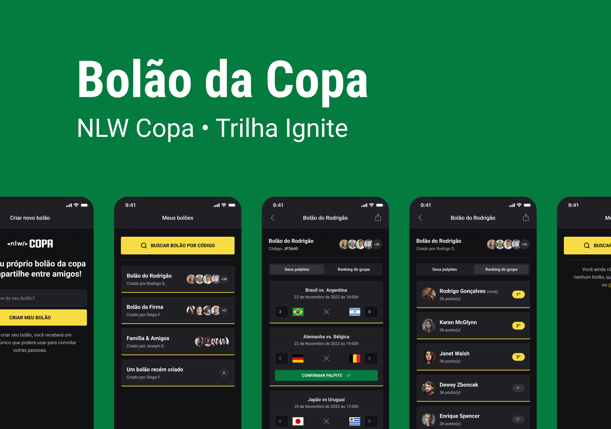

# Rocketseat NLW Copa

Evento da [Rocketseat](https://www.rocketseat.com.br). Aplicação para criar bolões da copa do mundo.

## Tech Stack

- [TypeScript](https://www.typescriptlang.org)

### Backend

- [Node](https://nodejs.org)
- [Fastify](https://www.fastify.io)
- [Prisma](https://www.prisma.io)
- [SQLite](https://www.sqlite.org/index.html)
- [yup](https://github.com/jquense/yup)

### Web

- [React](https://reactjs.org)
- [NextJS](https://nextjs.org)
- [Tailwind](https://tailwindcss.com)
- [React Toastify](https://fkhadra.github.io/react-toastify/introduction)

### App

- [React](https://reactjs.org)
- [React Native](https://reactnative.dev)
- [Expo](https://docs.expo.dev/index.html)
- [Native Base](https://nativebase.io)
- [React Navigation](https://reactnavigation.org)
- [Axios](https://axios-http.com)
